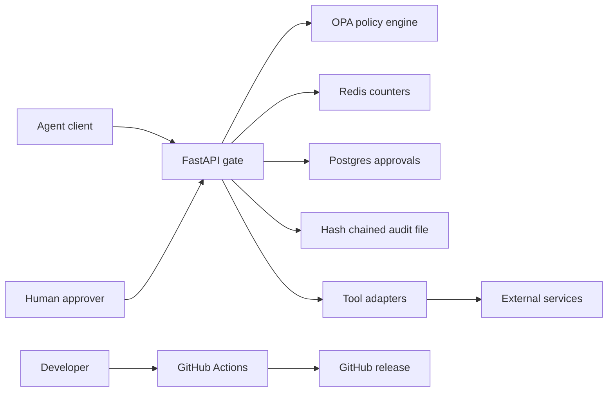

# Agent Security Gate Threat Model

## Executive Summary

The highest-risk areas are approval authorization, policy integrity, outbound HTTP
requests, and audit integrity. The current reference deployment has meaningful
controls, but its static bearer tokens, local audit file, demo credentials, and
DNS time-of-check/time-of-use window are not sufficient for an internet-facing
multi-tenant production service.

## Scope and Assumptions

In scope: `app/`, `adapters/`, `policies/`, `audit/`, `db/`, `docker-compose.yml`,
and security-relevant CI workflows.

Assumptions:

- The documented Docker Compose deployment is for local evaluation.
- Production would place TLS and identity-aware access controls in front of FastAPI.
- OPA policy files and runtime environment variables are operator-controlled.
- Agents may submit attacker-influenced prompts, tool arguments, and tool output.
- Multi-tenant isolation is not claimed by this reference implementation.

Out of scope: model-provider security, host compromise, and the security of external
tools after ASG permits their execution.

Open questions that change risk: whether the API is internet-exposed, whether tenants
share credentials, and whether requests may contain regulated or production data.

## System Model

### Primary Components

- FastAPI enforcement service and approval API: `app/main.py`
- Authentication and resume tokens: `app/auth.py`
- OPA policy decision point: `app/policy.py`, `policies/asg.rego`
- Postgres approval state and migrations: `db/`, `scripts/migrate_db.py`
- Redis request/session counters: `app/main.py`
- Outbound HTTP and document adapters: `adapters/`
- Hash-chained local audit events: `audit/events.py`
- CI, CodeQL, dependency audit, and benchmark evidence: `.github/workflows/`

### Data Flows and Trust Boundaries

- Agent -> FastAPI: JSON tool requests and bearer credentials over HTTP; Pydantic
  validates shape, auth checks the static token, and Redis enforces counters.
- FastAPI -> OPA: normalized policy input over internal HTTP; OPA decides allow,
  deny, or approval-required.
- Approver -> FastAPI -> Postgres: approval decisions and identity headers; approver
  authentication, self-approval prevention, row locking, and operation binding apply.
- FastAPI -> Redis/Postgres: session counts and approval state cross service boundaries
  using connection strings from operator-controlled environment variables.
- HTTP adapter -> external network: allowlisted URLs cross the egress boundary after
  URL normalization, DNS checks, and OPA authorization.
- FastAPI -> audit file: request/decision metadata crosses into a local append-only
  convention protected by hash chaining and file locking.
- Developer -> GitHub Actions -> release: repository changes trigger tests, CodeQL,
  dependency audit, benchmark gates, and tag-based releases.

#### Diagram

## Assets and Security Objectives

| Asset | Why it matters | Objective |
|---|---|---|
| Agent and approver credentials | Permit policy and approval operations | Confidentiality, integrity |
| Approval records and resume tokens | Authorize high-impact actions | Integrity, confidentiality |
| OPA policy and configuration | Defines the enforcement boundary | Integrity, availability |
| Tool arguments and outputs | May contain sensitive or attacker-controlled data | Confidentiality, integrity |
| Audit events | Support investigation and accountability | Integrity, availability |
| CI and release artifacts | Establish public supply-chain trust | Integrity |

## Attacker Model

### Capabilities

- Submit attacker-influenced prompts, tool arguments, URLs, and tool output through an
  authenticated or compromised agent.
- Replay captured requests or tokens.
- Attempt to exploit policy gaps, approval confusion, SSRF, DLP bypass, and resource
  exhaustion.
- Submit malicious repository changes through a pull request.

### Non-capabilities

- No assumed host, GitHub-owner, OPA-policy-author, or secret-manager compromise.
- No assumed ability to alter operator-controlled environment variables.
- No assumed network access to internal Compose services in a correctly isolated deployment.

## Entry Points and Attack Surfaces

| Surface | How reached | Trust boundary | Notes | Evidence |
|---|---|---|---|---|
| Gateway decision API | Authenticated HTTP | Agent -> API | Tool, context, and output are attacker-influenced | `app/main.py:gateway_decide` |
| Approval APIs | Authenticated HTTP | Approver -> API -> DB | High-impact authorization state | `app/main.py:approvals_approve` |
| HTTP proxy | Authenticated HTTP | API -> external network | SSRF and egress risk | `adapters/http.py:GatedHttpClient` |
| Document adapter | Tool integration | API -> document source | Authorization must precede read | `adapters/docs.py:DocAdapter` |
| Audit endpoint/file | Approver HTTP and filesystem | API -> audit sink | Tamper-evident, not immutable | `audit/events.py` |
| YAML/JSON policy data | Operator-controlled files | Operator -> runtime | Malformed or malicious policy changes | `app/dlp.py`, `app/policy.py` |
| CI and release workflows | Push, PR, tag | Contributor -> GitHub | Supply-chain and release integrity | `.github/workflows/` |

## Top Abuse Paths

1. Steal an agent bearer token, submit an unknown or high-impact tool request, and
   attempt to exploit a fail-open policy decision.
2. Obtain an approval resume token and replay or substitute a different operation.
3. Submit an allowlisted hostname that resolves or rebinds to a private address and
   use the HTTP adapter to reach internal services.
4. Place secrets in tool output and attempt to bypass DLP/canary detection or poison
   the audit trail.
5. Flood authenticated endpoints to exhaust Redis, Postgres, OPA, or audit storage.
6. Modify policy, workflow, or dependency inputs through a malicious repository change
   and publish a compromised release.

## Threat Model Table

| ID | Threat | Existing Controls | Gaps | Recommended Mitigations | Likelihood | Impact | Priority |
|---|---|---|---|---|---|---|---|
| TM-001 | Stolen static bearer token permits agent or approver actions | Separate tokens, constant-time comparison, self-approval block (`app/auth.py`, `app/main.py`) | No external identity, rotation, scopes, or per-tenant principals | Use OIDC/mTLS, short-lived scoped credentials, and centralized revocation | Medium | High | High |
| TM-002 | Approval token replay or operation substitution | Exact operation binding, issuer/audience JWT checks, single-use DB transition (`app/auth.py`, `app/main.py`) | Token remains bearer material until expiry | Reduce expiry, add token identifier and revocation telemetry | Low | High | Medium |
| TM-003 | SSRF reaches internal network through DNS rebinding | Scheme/IP/DNS checks, exact allowlist, redirects disabled (`adapters/http.py`) | DNS is resolved again by the HTTP client | Force egress through a proxy/firewall that resolves and connects atomically | Medium | High | High |
| TM-004 | Policy/config compromise disables enforcement | OPA fail-closed rules and protected branch checks (`policies/asg.rego`, `.github/workflows/`) | Runtime policy files are locally mounted and unsigned | Use signed/versioned policy bundles and alert on policy changes | Low | High | Medium |
| TM-005 | Audit file is altered, deleted, or filled | Hash chain and file locking (`audit/events.py`) | Local storage is not immutable and has no retention controls | Send events to append-only remote storage with access controls and alerts | Medium | Medium | Medium |
| TM-006 | Authenticated request flood exhausts dependencies | Redis counters and fail-closed dependency errors (`app/main.py`) | Static-token limits and no body-size/global concurrency limits | Add ingress limits, body-size caps, quotas, timeouts, and saturation alerts | Medium | Medium | Medium |
| TM-007 | Malicious dependency or workflow change compromises release | CodeQL, dependency audit, required checks, branch protection (`.github/workflows/`) | Actions use floating major tags and releases depend on repository workflow integrity | Pin actions by commit SHA and use artifact attestations | Low | High | Medium |

## Criticality Calibration

- Critical: unauthenticated remote code execution, systemic approval bypass, or release
  signing compromise.
- High: cross-boundary secret exfiltration, approver credential compromise, or reliable
  internal-network SSRF.
- Medium: authenticated denial of service, local audit integrity loss, or policy drift
  requiring contributor/operator access.
- Low: low-sensitivity information disclosure or noisy abuse with simple operational
  recovery.

## Focus Paths for Security Review

| Path | Why it matters | Threat IDs |
|---|---|---|
| `app/main.py` | Central request, approval, rate-limit, and audit orchestration | TM-001, TM-002, TM-006 |
| `app/auth.py` | Static credentials and resume-token validation | TM-001, TM-002 |
| `adapters/http.py` | Network egress and SSRF controls | TM-003 |
| `policies/asg.rego` | Authoritative runtime policy logic | TM-004 |
| `audit/events.py` | Audit-chain integrity and local storage behavior | TM-005 |
| `.github/workflows/` | Build, analysis, evidence, and release trust | TM-007 |

## Quality Check

- Runtime entry points and CI/release surfaces are separated.
- Each identified trust boundary is represented in the abuse paths and threat table.
- Existing mitigations are anchored to repository paths.
- Deployment, exposure, identity, and data-sensitivity assumptions remain explicit.
