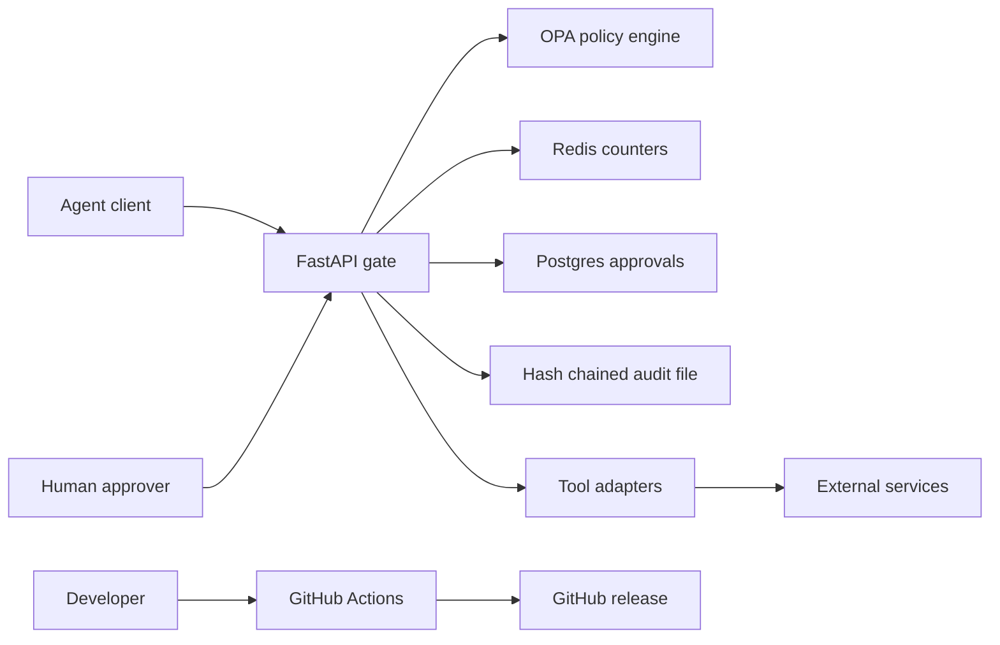

# Agent Security Gate Threat Model

## Executive Summary

The highest-risk areas are approval authorization, policy integrity, outbound HTTP
requests, and audit integrity. The current reference deployment has meaningful
controls, but demo credentials, optional static-token compatibility, locally mounted
policy, and local audit storage are not sufficient defaults for an internet-facing
multi-tenant production service. OIDC, strict tenant policies, HMAC signing, and an
immutable audit sink are available but must be configured by the operator.

## Scope and Assumptions

In scope: `app/`, `adapters/`, `policies/`, `audit/`, `db/`, `docker-compose.yml`,
and security-relevant CI workflows.

Assumptions:

- The documented Docker Compose deployment is for local evaluation.
- Production configures TLS and an external OIDC identity provider for FastAPI.
- OPA policy files and runtime environment variables are operator-controlled.
- Agents may submit attacker-influenced prompts, tool arguments, and tool output.
- Multi-tenant deployments enable `ASG_TENANT_POLICY_STRICT` and provide a dedicated
  policy file for every tenant; the fallback mode is intended for local/single-tenant use.

Out of scope: model-provider security, host compromise, and the security of external
tools after ASG permits their execution.

Open questions that change risk: whether the API is internet-exposed, whether tenants
share credentials, and whether requests may contain regulated or production data.

## System Model

### Primary Components

- FastAPI application and routers: `app/main.py`, `app/routers/`
- Shared authorization path: `app/decision.py`
- Authentication and resume tokens: `app/auth.py`
- OPA policy decision point: `app/policy.py`, `policies/asg.rego`
- Postgres approval state and migrations: `db/`, `scripts/migrate_db.py`
- Redis request/session counters: `app/decision.py`
- Outbound HTTP and document adapters: `adapters/`
- Hash-chained local audit events: `audit/events.py`
- CI, CodeQL, dependency audit, and benchmark evidence: `.github/workflows/`

### Data Flows and Trust Boundaries

- Agent -> FastAPI: JSON tool requests and bearer credentials over HTTP; Pydantic
  validates shape, auth verifies a configured static credential or signed OIDC JWT,
  and Redis enforces counters.
- FastAPI -> OPA: normalized policy input over internal HTTP; OPA decides allow,
  deny, or approval-required.
- Approver -> FastAPI -> Postgres: approval decisions and identity headers; approver
  authentication, self-approval prevention, row locking, and operation binding apply.
- FastAPI -> Redis/Postgres: session counts and approval state cross service boundaries
  using connection strings from operator-controlled environment variables.
- HTTP adapter -> external network: allowlisted URLs cross the egress boundary after
  URL normalization, DNS checks, and OPA authorization.
- FastAPI -> audit file: request/decision metadata crosses into a local append-only
  convention protected by hash chaining and file locking.
- Developer -> GitHub Actions -> release: repository changes trigger tests, CodeQL,
  dependency audit, benchmark gates, and tag-based releases.

#### Diagram

```mermaid
flowchart LR
  Agent["Agent client"] --> API["FastAPI gate"]
  Approver["Human approver"] --> API
  API --> OPA["OPA policy engine"]
  API --> Redis["Redis counters"]
  API --> Postgres["Postgres approvals"]
  API --> Audit["Hash chained audit file"]
  API --> Adapter["Tool adapters"]
  Adapter --> External["External services"]
  Developer["Developer"] --> CI["GitHub Actions"]
  CI --> Release["GitHub release"]
```

## Assets and Security Objectives

| Asset | Why it matters | Objective |
|---|---|---|
| Agent and approver credentials | Permit policy and approval operations | Confidentiality, integrity |
| Approval records and resume tokens | Authorize high-impact actions | Integrity, confidentiality |
| OPA policy and configuration | Defines the enforcement boundary | Integrity, availability |
| Tool arguments and outputs | May contain sensitive or attacker-controlled data | Confidentiality, integrity |
| Audit events | Support investigation and accountability | Integrity, availability |
| CI and release artifacts | Establish public supply-chain trust | Integrity |

## Attacker Model

### Capabilities

- Submit attacker-influenced prompts, tool arguments, URLs, and tool output through an
  authenticated or compromised agent.
- Replay captured requests or tokens.
- Attempt to exploit policy gaps, approval confusion, SSRF, DLP bypass, and resource
  exhaustion.
- Submit malicious repository changes through a pull request.

### Non-capabilities

- No assumed host, GitHub-owner, OPA-policy-author, or secret-manager compromise.
- No assumed ability to alter operator-controlled environment variables.
- No assumed network access to internal Compose services in a correctly isolated deployment.

## Entry Points and Attack Surfaces

| Surface | How reached | Trust boundary | Notes | Evidence |
|---|---|---|---|---|
| Gateway decision API | Authenticated HTTP | Agent -> API | Tool, context, and output are attacker-influenced | `app/decision.py`, `app/routers/decide.py` |
| Approval APIs | Authenticated HTTP | Approver -> API -> DB | High-impact authorization state | `app/routers/approvals.py` |
| Approval console | Approver browser -> API; stored agent input -> browser | Agent -> DB -> approver browser | Agent-controlled fields must remain text, never active content | `app/static/approvals.js`, `app/routers/ui.py` |
| HTTP proxy | Authenticated HTTP | API -> external network | SSRF and egress risk | `adapters/http.py:GatedHttpClient` |
| Document adapter | Tool integration | API -> document source | Authorization must precede read | `adapters/docs.py:DocAdapter` |
| Audit endpoint/file | Approver HTTP and filesystem | API -> audit sink | Tamper-evident locally; optionally HMAC-signed and mirrored to immutable WORM storage | `audit/events.py`, `audit/sinks.py` |
| YAML/JSON policy data | Operator-controlled files | Operator -> runtime | Malformed or malicious policy changes | `app/dlp.py`, `app/policy.py` |
| CI and release workflows | Push, PR, tag | Contributor -> GitHub | Supply-chain and release integrity | `.github/workflows/` |

## Top Abuse Paths

1. Steal an agent bearer token, submit an unknown or high-impact tool request, and
   attempt to exploit a fail-open policy decision.
2. Obtain an approval resume token and replay or substitute a different operation.
3. Submit an allowlisted hostname that resolves or rebinds to a private address and
   use the HTTP adapter to reach internal services.
4. Place secrets in tool output and attempt to bypass DLP/canary detection or poison
   the audit trail. DLP/canary scanning is a return-path control: it redacts matches,
   fails the call closed, and audits the block before the agent sees the output; it does
   not undo a side effect the tool already performed.
5. Flood authenticated endpoints to exhaust Redis, Postgres, OPA, or audit storage.
6. Modify policy, workflow, or dependency inputs through a malicious repository change
   and publish a compromised release.

## Threat Model Table

| ID | Threat | Existing Controls | Gaps | Recommended Mitigations | Likelihood | Impact | Priority |
|---|---|---|---|---|---|---|---|
| TM-001 | Stolen agent or approver credential permits privileged actions | Optional OIDC JWT validation with roles, separate static compatibility tokens, constant-time comparison, and self-approval prevention (`app/auth.py`) | Static compatibility tokens have no built-in rotation or centralized revocation | Configure OIDC with short-lived scoped credentials; disable static credentials where possible | Medium | High | High |
| TM-002 | Approval token replay or operation substitution | Exact operation binding, issuer/audience JWT checks, and atomic single-use consumption (`app/auth.py`, `approvals/service.py`) | Token remains bearer material until expiry | Reduce expiry, protect transport/storage, and add revocation telemetry | Low | High | Medium |
| TM-003 | SSRF reaches internal network through DNS rebinding | Scheme/IP/DNS checks, exact allowlist, redirects disabled, connect-time IP pinning to the validated address, and connection reuse disabled so every request re-resolves and re-pins (`adapters/http.py`) | Egress is still host-based, not proxy-mediated, so a resolver compromised between the check and the kernel connect on the same request is not covered | Force egress through a proxy/firewall that resolves and connects atomically | Low | High | Medium |
| TM-004 | Policy/config compromise disables enforcement | OPA fail-closed rules and protected branch checks (`policies/asg.rego`, `.github/workflows/`) | Runtime policy files are locally mounted and unsigned | Use signed/versioned policy bundles and alert on policy changes | Low | High | Medium |
| TM-005 | Audit file is altered, deleted, or filled | Hash chain and file locking, optional HMAC signing, and an optional S3 Object Lock (WORM) mirror with a chain-follow bundle verifier (`audit/events.py`, `audit/sinks.py`, `scripts/verify_audit.py`) | The local file itself is still deletable and not multi-writer safe; WORM guarantees depend on correct bucket Object Lock configuration and key/bucket separation | Enable `AUDIT_HMAC_KEY` + `AUDIT_S3_BUCKET` with Object Lock retention in production; keep the signing key on a separate trust boundary and alert on verification failures | Low | Medium | Medium |
| TM-006 | Authenticated request flood exhausts dependencies | Per-caller Redis counters and fail-closed dependency errors (`app/decision.py`) | No body-size or global concurrency limit in the application | Add ingress limits, body-size caps, quotas, timeouts, and saturation alerts | Medium | Medium | Medium |
| TM-007 | Malicious dependency or workflow change compromises release | Commit-pinned Actions, CodeQL, dependency audits, required checks, and protected `main` (`.github/workflows/`) | Release artifacts are not independently signed or attested | Add artifact attestations and protected signing identity | Low | High | Medium |
| TM-008 | Agent-controlled approval metadata executes active content in an approver browser | Safe DOM construction with `textContent`, no HTML parsing sinks, same-origin external assets, restrictive CSP, frame denial, and regression tests (`app/static/approvals.js`, `app/routers/ui.py`, `tests/test_ui.py`) | The console remains a reference demo and has not received independent browser-level penetration testing | Retain CSP and safe DOM invariants; include stored-content payloads in independent review | Low | High | Medium |
| TM-009 | Time-bound policy exception used as a silent escalation path | Creation requires an authenticated approver and `X-Approver-Id`; exceptions never bypass safety rails (sensitivity, unknown tool, `max_actions`, output cap) in `policies/asg.rego`; creation is written to the hash-chained audit log, counted in `asg_policy_exceptions_created_total`, and logged at WARNING; an empty `context_match` requires explicit `allow_broad` plus a reason; TTL is capped by `ASG_MAX_EXCEPTION_TTL_S`; `scripts/check_policy_exceptions.py` reconciles active rows against creation events (`app/routers/exceptions.py`, `app/exceptions.py`) | A direct database write bypasses the router; reconciliation must be run to detect it, and the audit log rather than the mutable row is the source of truth | Alert on `policy_exception_created` events and reconciliation failures; restrict direct database access | Low | High | Medium |

## Criticality Calibration

- Critical: unauthenticated remote code execution, systemic approval bypass, or release
  signing compromise.
- High: cross-boundary secret exfiltration, approver credential compromise, or reliable
  internal-network SSRF.
- Medium: authenticated denial of service, local audit integrity loss, or policy drift
  requiring contributor/operator access.
- Low: low-sensitivity information disclosure or noisy abuse with simple operational
  recovery.

## Focus Paths for Security Review

| Path | Why it matters | Threat IDs |
|---|---|---|
| `app/decision.py` | Central policy, rate-limit, grant, and audit orchestration | TM-001, TM-004, TM-006 |
| `app/auth.py` | OIDC/static credentials and resume-token validation | TM-001, TM-002 |
| `adapters/http.py` | Network egress and SSRF controls | TM-003 |
| `policies/asg.rego` | Authoritative runtime policy logic | TM-004 |
| `audit/events.py` | Audit-chain integrity and local storage behavior | TM-005 |
| `.github/workflows/` | Build, analysis, evidence, and release trust | TM-007 |
| `app/static/approvals.js` | Privileged browser handling of stored agent-controlled values | TM-008 |
| `app/routers/exceptions.py` | Creation, auditing, and breadth/TTL limits of time-bound policy exceptions | TM-009 |

## Quality Check

- Runtime entry points and CI/release surfaces are separated.
- Each identified trust boundary is represented in the abuse paths and threat table.
- Existing mitigations are anchored to repository paths.
- Deployment, exposure, identity, and data-sensitivity assumptions remain explicit.
