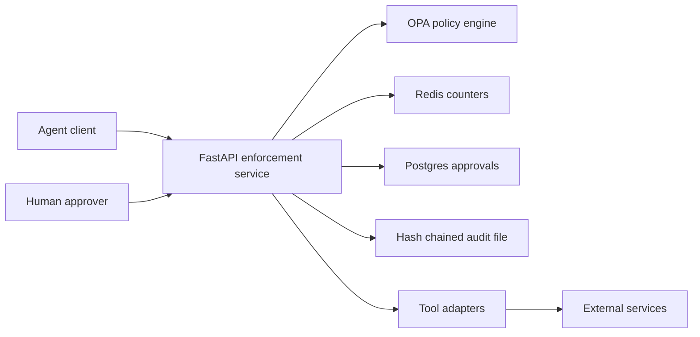

# Architecture

Agent Security Gate is a reference implementation of a policy enforcement point for tool-using agents. The service path is FastAPI + OPA. The `gateway/` package retains shared models; benchmark replay routes through the runtime decision path via `benchmark/runtime_gate.py`.

For multi-replica deployments, run ≥2 stateless gateway replicas behind a load balancer;
shared state is Redis + Postgres only. Each replica writes to its own audit stream when
`ASG_REPLICA_ID` is set (see `docs/runbooks/ha-deployment.md`). Production should mirror
audit to S3 Object Lock instead of relying on shared local files.

## Core modules

- `gateway/`
  - shared benchmark models (`ToolCallRequest`, `Decision`)
  - `pep.py` is a deprecated facade over `benchmark/runtime_gate.RuntimeGateClient`
- `app/`
  - exposes `/v1/gateway/decide`
  - builds OPA input, evaluates Rego decisions, records audit events
  - `main.py`: app factory, lifespan, pooled clients, shared decision logic (`_decide_tool_call`), rate limiting, and the tool-output scan middleware
  - `routers/`: HTTP route handlers grouped by concern (`observability`, `approvals`, `tools`, `agent`, `decide`); they call back into `app.main` for shared logic and pooled clients
  - `auth.py`: bearer-token dependencies and approval resume-token signing
  - `config.py`: environment variables, demo-mode defaults, runtime paths
  - `dlp.py`: YAML-backed DLP and canary scanning
  - `policy.py`: OPA input construction and PDP HTTP calls
  - `metrics.py`: Prometheus metrics and structured decision logging
  - `schemas.py`: FastAPI request/response models
  - `audit_log.py`: application-level audit event wrapper
- `approvals/`
  - contains the legacy in-memory approval helper used by the benchmark
- Postgres-backed approvals in `app/routers/approvals.py`
  - creates and resolves approval requests for risky runtime actions
- `audit/`
  - writes hash-chained JSONL events
- `adapters/`
  - wraps tool integrations so policy checks happen before side effects
- `benchmark/`
  - replays deterministic scenarios against `no_gate` and `gate` baselines
  - `gate` calls `_decide_tool_call_impl` via `runtime_gate.py` (runtime parity)
  - reports attack success, leakage, utility, latency, and per-attack-class results

## Notes

- The local JSONL audit log is tamper-evident, not tamper-proof. Production use should move this behind an append-only audit sink.
- Multi-replica: set `ASG_REPLICA_ID` (or use `docker-compose.ha.yml`) so each replica owns `events-<replica>.jsonl`; never share one `events.jsonl` across writers.
- Demo credentials are accepted only when `ASG_DEMO_MODE=true`.
- The benchmark `gate` baseline exercises `_decide_tool_call_impl` via `RuntimeGateClient`, sharing Python pre-checks, OPA policy, and output scanning with production. HTTP egress uses the same `evaluate_http_target()` with DNS resolution disabled for deterministic offline replay.
- Database migrations are recorded with checksums in `schema_migrations`; changing an applied migration fails startup.
- See `docs/agent-security-gate-threat-model.md` for trust boundaries and known security limitations.
