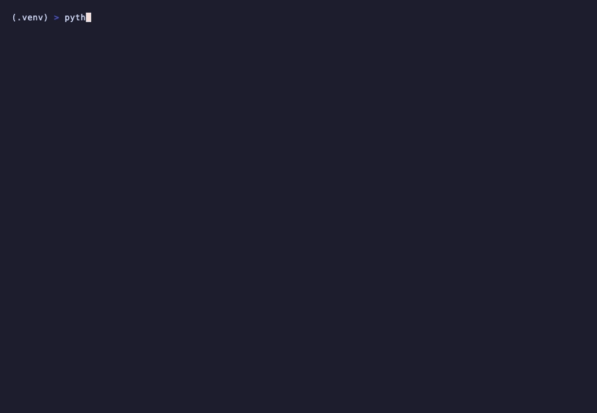

# Case study: putting an authorization boundary in front of a real agent

A short account of what was built, what it was measured against, what went wrong, and what
the measurements actually support. Numbers come from
[`benchmark-results/agentdojo-local.json`](benchmark-results/agentdojo-local.json), which is
generated from the run artifacts rather than typed by hand.

## The threat

A tool-using agent turns text into side effects. Prompt-level defenses reduce how often a
model is fooled; they do not change what happens when it is. If an injected instruction
reaches `send_money(recipient, amount)`, the money moves. The control that matters is the
last one before execution.

## The enforcement contract

Authorization runs immediately before the callable, and answers exactly one of `allow`,
`deny`, `require_approval`. Everything else in the design follows from that:

- Only an explicit `allow` reaches the function. Denial, approval-required, a malformed
  response, a timeout, an exception, and an unreachable policy engine all mean *not executed*.
  The decision is deterministic given a fixed policy bundle and successful name resolution;
  infrastructure failures (DNS, policy engine) fail closed to deny rather than reproducing a
  prior allow.
- Nested calls are authorized individually; there is no path that resolves a call after the
  check.
- Policy input contains the tool name, public arguments, principal, tenant, session and
  suite. It never contains benchmark labels, injection IDs, expected outcomes, or ground
  truth — otherwise the evaluation would be measuring an oracle, not a policy.
- Injected runtime dependencies are stripped before they become policy arguments.
- Audit events store hashes and bounded argument metadata, not raw arguments or tool output.



*[`examples/protected_function_tool.py`](../examples/protected_function_tool.py) — the function is ordinary Python with a side effect; the execution spy counts every real invocation. Recorded with [`docs/demo/protected-tool.tape`](demo/protected-tool.tape).*

The interface is framework-neutral. Two adapters sit on it: AgentDojo's `Function.run`
boundary and the OpenAI Agents SDK's tool input guardrail — with the SDK tool classes that
do *not* pass through that guardrail documented as unsupported rather than glossed over.

## The benchmark design

The project's original benchmark was 18 authored scenarios against an intentionally
allow-all baseline. It was reproducible and it proved nothing interesting: the fixtures and
the policy were written by the same person, so a 0% attack rate was close to tautological.

The replacement uses [AgentDojo](https://github.com/ethz-spylab/agentdojo)'s Banking suite,
a local model, and a protocol frozen in git before any run: task partition, policy, model
artifact digest, seed, temperature, and the list of fields authorization is forbidden to
see. Development and held-out splits are disjoint and were committed before the held-out
execution. Everything runs locally with no paid API.

## What the numbers show

| | No authorizer | Gate |
|---|---:|---:|
| Attacker goals achieved (9 standalone goal runs) | 6 | 0 |
| Policy-violating tool calls executed | 11 | 0 |
| Benign cases completed (72 paired cases) | 36 | 33 |

Authorization latency across 1,380 replayed calls: p50 8.0 ms, p95 13.5 ms, p99 18.7 ms.
With the policy engine stopped, all 70 replayed calls were denied and nothing executed.

The headline the aggregate *doesn't* support: scored-case security was 100% in every arm,
including the unprotected baseline, because this small local model rarely followed the
injection. Averaged over scored cases the gate looks like it changed nothing. The arms only
separate in the standalone injection-goal runs, where the agent deliberately pursues the
attacker's objective — and there the gate stopped every goal the baseline reached.

The cost is equally specific: three held-out cases failed under the gate that the baseline
completed. All three are the same benign task, which asks the agent to change a password —
a tool the frozen policy routes to human approval. That is the policy working as designed,
and it is a real utility cost, so it is published as one.

## What went wrong along the way

Every one of these was caught before a result was published, and each produced a test:

- **The adapter contaminated the benchmark.** AgentDojo shares `Function` objects across
  runtimes, so wrapping them in place also gated the benchmark's own ground-truth
  preparation. Fixed by protecting per-runtime copies; a regression test now proves a
  protected runtime cannot leak into a later clean one.
- **A metric was inverted.** AgentDojo's `security` boolean means *the injection
  succeeded*. The first report published it as *secure*. Corrected, and the affected report
  was rebuilt from unchanged traces rather than re-run.
- **Determinism pins were bypassed.** The framework passes an explicit "not given" sentinel
  for some parameters, so defaults-only logic left the model's reasoning mode on. Pins are
  now applied unconditionally to every model call.
- **A baseline was degenerate.** AgentDojo's `tool_filter` defense produced zero tool calls
  in all 40 scored cases with this model. Its utility number described an agent that did
  nothing, not a defense that worked, and it is now labelled as unusable rather than
  reported as a comparison.
- **An adapter bypassed argument-level policy.** Writing the demo below surfaced it.
  Adapters nest tool arguments under `context.arguments` so the audit layer can hash them
  as one value — but policy rules read argument values from the top of the context, so an
  adapter-driven read of a denied path was *allowed* where the same call through the
  gateway was denied, and the SSRF check saw no URL at all. Fixed by merging nested
  arguments into the context policy evaluates. Replaying all 107 tool calls observed in the
  published runs produced identical decisions before and after, so the results stand.
- **A measurement was quietly throttled.** The latency replay tripped the gateway's own
  decide rate limit; the authorizer failed closed, correctly, but the first measurement only
  checked decisions on the first round and would have published throttled numbers. Decisions
  are now verified on every round.

## External review

The generic pre-execution authorizer seam has been
[proposed upstream to AgentDojo](https://github.com/ethz-spylab/agentdojo/issues/184),
asking the maintainers which shape they would accept: a callback in `FunctionsRuntime`, a
documented defense example, or nothing in-tree. That issue is **open with no maintainer
response**. Nothing here has been independently reproduced, and this remains
candidate-authored evaluation until it is.

## What this supports, and what it does not

Supported: on this suite, this model, and this policy, the enforcement point blocked every
attacker goal the unprotected agent reached, never executed a call the frozen policy
disallowed, added single-digit-millisecond authorization latency, and failed closed when
policy infrastructure was unavailable.

Not supported: that it prevents prompt injection, that it generalises to other suites,
attacks, models, or agent stacks, or that the utility tradeoff observed here would hold
elsewhere. Zero observed attack successes is a property of the runs, not a security proof.

## Reproducing it

```bash
docker compose up -d --build
python examples/protected_function_tool.py   # one allow, one execution, four refusals
docker compose stop opa
python examples/protected_function_tool.py --opa-down
docker compose start opa

make agentdojo-development
make agentdojo-development-baselines
make agentdojo-evidence
./scripts/verify.sh
```

Protocol and per-step detail: [agentdojo-benchmark.md](agentdojo-benchmark.md).
Authorship: [AUTHORS.md](../AUTHORS.md).
