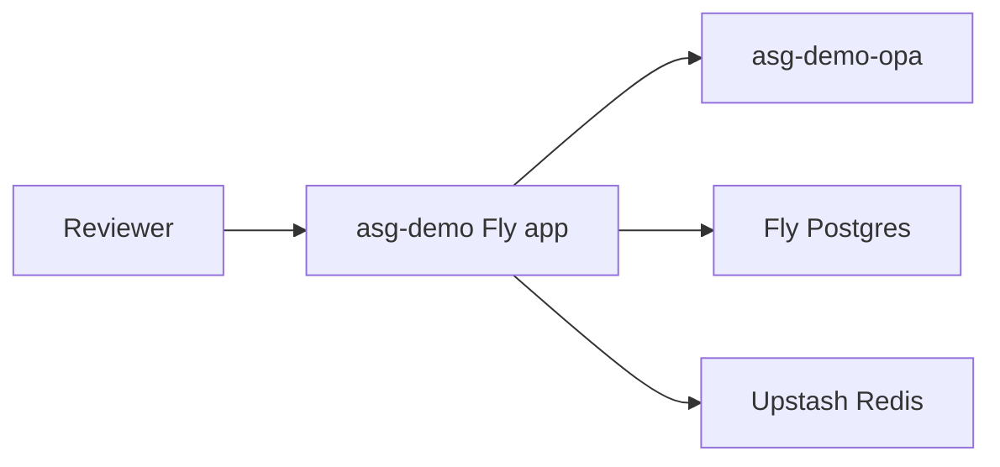

# Fly.io demo deployment

Public reference demo for recruiters and design partners. **Not for production use.**

## Architecture



## Quick bootstrap (recommended)

```bash
brew install flyctl
flyctl auth login
./scripts/fly_demo_bootstrap.sh
```

The bootstrap script creates `asg-demo` + `asg-demo-opa`, attaches Postgres, sets secrets, and prints your demo URL and tokens.

## Manual steps

```bash
# Postgres (approvals)
fly postgres create --name asg-demo-db --region ams
fly postgres attach asg-demo-db -a asg-demo

# Upstash Redis (rate limits) — create at console.upstash.com, then:
fly secrets set REDIS_URL="rediss://..." -a asg-demo
```

## 2. Deploy OPA

```bash
cd /path/to/agent-security-gate
fly launch --config deploy/fly-opa.toml --no-deploy --copy-config
# Mount policies: use fly volumes or bake policies into a custom OPA image for demo
fly deploy --config deploy/fly-opa.toml
```

For a minimal demo, point the gateway at a co-located OPA URL:

```bash
fly secrets set OPA_URL="http://asg-demo-opa.internal:8181" -a asg-demo
```

## 3. Deploy gateway

```bash
fly launch --config deploy/fly.toml --no-deploy --copy-config
fly secrets set \
  AUTH_TOKEN="demo-$(openssl rand -hex 16)" \
  APPROVER_TOKEN="approver-$(openssl rand -hex 16)" \
  JWT_SECRET="$(openssl rand -base64 32)" \
  -a asg-demo
fly deploy --config deploy/fly.toml
```

## 4. Verify

```bash
fly open /health -a asg-demo
curl -s "https://asg-demo.fly.dev/health"
curl -s -X POST "https://asg-demo.fly.dev/agent" \
  -H "Authorization: Bearer <AUTH_TOKEN>" \
  -H "Content-Type: application/json" \
  -d '{"input":"read /internal/secrets.yaml"}'
```

## Demo constraints

- `ASG_DEMO_MODE=true` — demo tokens only; rotate secrets after sharing URLs publicly
- Rate limiting enabled
- Audit log on ephemeral disk (`/tmp`) — not durable across machine restarts
- Banner in README: reference demo, not production

## One-command local alternative

Reviewers without Fly access can use:

```bash
docker compose up -d --build
```

## Update profile README

After deploy, set the live URL in `giselleevita/giselleevita` profile README and [README.md](../README.md) **Try it** section.

Track remaining tasks: [VISIBILITY_SPRINT.md](./VISIBILITY_SPRINT.md) · verify with `scripts/check_visibility_sprint.sh`
