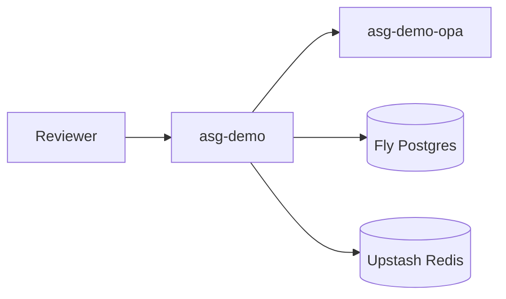

# Fly.io demo deployment

Public reference demo for recruiters and design partners. **Not for production use.**

## Live demo

| URL | Purpose |
|-----|---------|
| https://asg-demo.fly.dev | Gateway (deploy with bootstrap below) |
| https://asg-demo.fly.dev/health | Liveness |
| https://asg-demo.fly.dev/health/ready | OPA + Redis readiness |
| https://asg-demo.fly.dev/demo | Public curl examples + demo tokens |

## Demo mode constraints

- `ASG_DEMO_MODE=true` — fixed demo tokens, no recruiter secrets required
- **Agent token:** `test-token`
- **Approver token:** `approver-token`
- Mock tool routing via `/agent` — fixed attack/safe scenarios only
- Audit log on ephemeral disk (`/tmp`) — not durable across machine restarts
- Machines auto-stop when idle (free tier friendly)

## One-command deploy

```bash
brew install flyctl
flyctl auth login
./scripts/fly_demo_bootstrap.sh
./scripts/verify_fly_demo.sh https://asg-demo.fly.dev
```

The bootstrap script creates:

- `asg-demo-opa` — OPA with policies baked into the image
- `asg-demo-db` — Fly Postgres (approvals)
- `asg-demo-redis` — Upstash Redis (rate limits)
- `asg-demo` — FastAPI gateway

## Architecture



## Verify after deploy

```bash
curl -s https://asg-demo.fly.dev/health
curl -s https://asg-demo.fly.dev/demo | jq .

curl -s -X POST https://asg-demo.fly.dev/agent \
  -H "Authorization: Bearer test-token" \
  -H "Content-Type: application/json" \
  -d '{"input":"read /internal/secrets.yaml"}'
```

## Local alternative

Reviewers without Fly access:

```bash
docker compose up -d --build
open http://localhost:8000/demo
```

## Update profile README

After deploy, confirm the live URL in:

- [README.md](../README.md) **Try it** section
- `giselleevita/giselleevita` profile README
- [portfolio](https://github.com/giselleevita/portfolio) hero CTA

## Manual overrides

```bash
export ASG_FLY_APP=asg-demo
export ASG_FLY_REGION=ams
export ASG_FLY_ORG=personal
./scripts/fly_demo_bootstrap.sh
```
