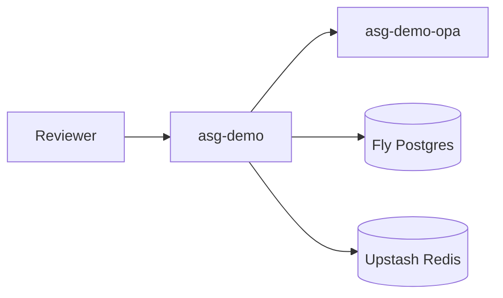

# Fly.io demo deployment (optional — costs money)

> **Skip this for a free portfolio.** Use the README GIF + `docker compose up` instead.
> Fly Postgres and Redis run 24/7 and typically cost **~$3–10+/month** even when the gateway is idle.

Public reference demo for recruiters who need a hosted URL. **Not for production use.**

## Free alternative (recommended)

```bash
docker compose up -d --build
open http://localhost:8000/demo
```

The README GIF and MP4 work without any hosting bill.

## If you still want Fly (paid)

See sections below. Requires a credit card on file.

## Live demo URLs (after paid deploy)

| URL | Purpose |
|-----|---------|
| https://asg-demo.fly.dev | Gateway |
| https://asg-demo.fly.dev/demo | Public curl examples |

## One-command deploy

```bash
flyctl auth login
./scripts/fly_demo_bootstrap.sh
./scripts/verify_fly_demo.sh https://asg-demo.fly.dev
```

## Demo mode constraints

- `ASG_DEMO_MODE=true` — fixed demo tokens (`test-token`, `approver-token`)
- Mock tool routing via `/agent` only
- Audit log on ephemeral disk — not durable across restarts
- Machines auto-stop when idle (compute savings; Postgres/Redis still bill)

## Architecture



## Tear down (stop charges)

```bash
fly apps destroy asg-demo asg-demo-opa
fly postgres destroy asg-demo-db
fly redis destroy asg-demo-redis
```

## Local alternative

```bash
docker compose up -d --build
curl -s http://localhost:8000/demo | jq .
```
