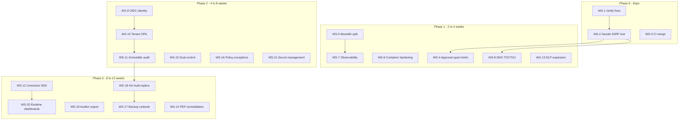

# Agent Security Gate — Technical Hardening Strategy

**As-of:** 2026-07-08  
**Source:** [investment-assessment.md](investment-assessment.md) (technical findings only)  
**Goal:** Raise investable technical posture from **2.8 / 5.0** toward **4.0+** by closing every open technical, security, and operability gap with verifiable workstreams.

**Status:** All workstreams WS-1 through WS-21 (phases 0–3) are **implemented on `main`**. See [investor-readiness.md](investor-readiness.md) for the completion checklist and revised scorecard.

---

## 1. Purpose and scope

### Purpose

This document turns open findings from the investment diligence assessment into **concrete, phased workstreams** with target designs, acceptance criteria, tests, effort estimates, and scorecard impact. Each workstream is directly actionable against files in this repository.

### Scope (in)

- Technical correctness and enforcement completeness
- Security and trust posture (identity, tenancy, audit, SSRF)
- Architecture, scalability, and operability
- Delivery quality (tests, CI, decomposition)
- Enterprise platform must-haves that are implementable in code

### Scope (out) — explicit non-goals

The following are **deferred to a separate business/GTM plan** and are not covered here:

- BSL-1.1 license change or relicensing strategy
- Market validation, pricing, packaging, sales motion
- Hiring, team structure, bus factor (R11)
- Incumbent competitive response (R1, R2)
- Benchmark headline marketing (R10) beyond README accuracy

### Target scorecard movement

| Dimension | Current (assessment §12) | Phase 3 target |
|-----------|--------------------------|----------------|
| Technical correctness | 3.5 | 4.5 |
| Architecture / scalability | 2.5 | 4.0 |
| Security / trust | 3.0 | 4.5 |
| Enterprise readiness | 1.5 | 3.5 |
| Delivery / engineering quality | 4.0 | 4.5 |
| **Weighted overall** | **2.8** | **4.0+** |

Problem/thesis clarity (4.5) and market viability (2.0) are largely unchanged by this technical plan.

---

## 2. Finding-to-workstream traceability

Every **open**, **partial**, or **delivery-debt** finding from the assessment maps to a named workstream (WS) and phase.

| ID | Finding / risk | Severity | WS | Phase | Status today |
|----|----------------|----------|-----|-------|--------------|
| F1 | Enforcement path-dependent (agents bypass adapters) | High | WS-12 | 3 | **Done** (opt-in `ASG_ENFORCE_MODE=strict` + SDK) |
| F2 | DNS TOCTOU on HTTP egress (TM-003) | Medium | WS-8 | 1 | **Done** |
| F3 | `tenant_id` unused in OPA | High | WS-10 | 2 | **Done** |
| F4 | Static bearer tokens + demo secrets (R7) | High | WS-9 | 2 | **Done** (OIDC + `*_FILE` secrets) |
| F5 | Single-node audit file (R6) | High | WS-11 | 2 | **Done** (S3 sink + export; local dev per-replica) |
| F6 | Approval request unbounded inserts (approval spam) | Medium | WS-4 | 1 | **Done** |
| F7 | Container runs as root, no read-only rootfs | Medium | WS-6 | 1 | **Done** |
| F8 | No metrics / tracing / log aggregation | Medium | WS-7 | 1 | **Done** (metrics + JSON logs; no OTLP traces) |
| F9 | `app/main.py` god module (R8) | Medium | WS-5 | 1 | **Done** (routers extracted; shared logic remains in main) |
| F10 | No SSRF integration test on decide path (R12) | Medium | WS-2 | 0 | **Done** |
| F11 | Integration tests not in main CI job | Low | WS-3 | 0 | **Done** (`ci.yml` integration job) |
| F12 | Centrally enforce across agents (advertised) | Medium | WS-12 | 3 | **Done** (documented opt-in strict) |
| F13 | DLP partial coverage (docs adapter only) | Low | WS-13 | 1 | **Done** (decide + docs + http proxy) |
| F14 | Dual code paths (runtime + benchmark PEP) | Low | WS-14 | 3 | **Done** |
| F15 | No dual-control / SoD beyond self-approval | Medium | WS-15 | 2 | **Done** |
| F16 | No time-bound policy exceptions | Medium | WS-16 | 2 | **Done** |
| F17 | No backup/restore runbook | Medium | WS-17 | 3 | **Done** |
| F18 | No HA / multi-replica story | High | WS-18 | 3 | **Done** |
| F19 | No auditor export packages | Medium | WS-19 | 3 | **Done** |
| F20 | No runtime reporting / dashboards | Medium | WS-20 | 3 | **Done** |
| F21 | Secret management (env vars only) | Medium | WS-21 | 2 | **Done** |
| F22 | Image digest pinning in compose | Low | WS-6 | 1 | **Done** |
| F23 | Uncommitted hardening fixes not in release | Medium | WS-1 | 0 | **Done** |

### Already fixed (verify in Phase 0, do not re-implement)

| Issue | Artifact | WS-1 verification |
|-------|----------|-------------------|
| SSRF on `/v1/gateway/decide` | [adapters/http.py](../adapters/http.py), [app/main.py](../app/main.py) | Integration test WS-2 |
| Benchmark/runtime HTTP semantics | [benchmark/runtime_gate.py](../benchmark/runtime_gate.py) | `tests/test_benchmark_runtime_parity.py` |
| Client `output_length` bypass | [app/policy.py](../app/policy.py) | Unit test |
| DLP + post-fetch scan | [adapters/docs.py](../adapters/docs.py), [tests/test_dlp.py](../tests/test_dlp.py) | Unit tests |
| Decide rate limit + 429 shape | [app/config.py](../app/config.py), [tests/test_decide_rate_limit.py](../tests/test_decide_rate_limit.py) | Unit test |
| Atomic session counter | [app/main.py](../app/main.py) | Integration test |
| O(1) audit append | [audit/events.py](../audit/events.py) | [tests/test_verify_audit.py](../tests/test_verify_audit.py) |
| Single OPA `decision` query | [policies/asg.rego](../policies/asg.rego) | OPA eval + integration |
| Approval context fingerprint | `_operation_key()` in [app/main.py](../app/main.py) | Integration test |
| Connection pooling | [app/main.py](../app/main.py) | Load smoke (manual) |

---

## 3. Phase dependency roadmap

**Critical path:** Phase 0 → Phase 1 (safety + observability) → Phase 2 (identity + tenancy + audit) → Phase 3 (platform + scale).

---

## 4. Phase 0 — Verify and lock in (days)

**Objective:** Merge current hardening, close the decide-path SSRF test gap, and make CI the single gate for runtime correctness.

### WS-1: Verify and release current hardening

| Field | Detail |
|-------|--------|
| **Problem** | Substantial fixes exist on the working tree but are uncommitted/unreleased; investors and CI may evaluate stale behavior. |
| **Target design** | Single release branch with all fixes merged; CHANGELOG entry; version bump if needed. |
| **Files touched** | [RELEASE](../RELEASE), [CHANGELOG.md](../CHANGELOG.md), all modified files from review cycle |
| **Acceptance criteria** | `pytest -m "not integration"` and `pytest -m integration` (with Docker) pass; benchmark thresholds pass; `opa check policies/asg.rego` passes |
| **Tests** | Full unit + integration suite; `make compare && make gate` |
| **Effort** | S |
| **Scorecard** | Technical correctness +0.2 |

### WS-2: Decide-path SSRF integration test (R12)

| Field | Detail |
|-------|--------|
| **Problem** | `evaluate_http_target` is unit-tested, but `/v1/gateway/decide` with `tool: http.get` and metadata IP is not integration-tested. |
| **Target design** | New test in [tests/integration/test_decide.py](../tests/integration/test_decide.py): POST decide with `http.get` + `169.254.169.254` → `allowed: false`, reason contains `ssrf_blocked`. |
| **Files touched** | [tests/integration/test_decide.py](../tests/integration/test_decide.py) |
| **Acceptance criteria** | Test fails if SSRF check removed from decide path; passes in CI integration workflow |
| **Tests** | `pytest -m integration tests/integration/test_decide.py::test_decide_blocks_http_get_metadata_ip` |
| **Effort** | S |
| **Scorecard** | Technical correctness +0.3, Delivery +0.1 |

### WS-3: Merge integration into main CI gate

| Field | Detail |
|-------|--------|
| **Problem** | Unit tests run in [ci.yml](../.github/workflows/ci.yml); integration runs in separate [integration.yml](../.github/workflows/integration.yml). A green unit CI does not prove runtime. |
| **Target design** | Either: (a) add `integration` job as required check in same workflow with `needs: [test]`, or (b) document integration as required branch protection check. Prefer (a). |
| **Files touched** | [.github/workflows/ci.yml](../.github/workflows/ci.yml) or branch protection docs in [CONTRIBUTING.md](../CONTRIBUTING.md) |
| **Acceptance criteria** | PR cannot merge without integration green (or explicit documented exception for fork PRs) |
| **Tests** | CI run on sample PR |
| **Effort** | S |
| **Scorecard** | Delivery +0.2 |

---

## 5. Phase 1 — Hardening and safety (2–4 weeks)

**Objective:** Close medium-severity security/ops gaps without requiring enterprise IdP. Make the gateway observable and deployable with safer defaults.

### WS-4: Approval request rate limit and TTL cleanup

| Field | Detail |
|-------|--------|
| **Problem** | `POST /v1/approvals/request` accepts arbitrary inserts with no rate limit or expiry ([app/main.py](../app/main.py)); enables DB growth DoS. |
| **Target design** | Per-tenant/session rate limit on approval creation; `expires_at` column on `approvals`; background job or startup sweep marks expired `pending` as `expired`; index on `(tenant_id, status, created_at)`. |
| **Files touched** | [app/main.py](../app/main.py), [db/migrations/](../db/migrations/), [db/init.sql](../db/init.sql), [app/config.py](../app/config.py) |
| **Acceptance criteria** | 429 on approval spam; expired pending rows not consumable; integration test for expiry |
| **Tests** | Unit test for rate limit; integration test for expired approval denial |
| **Effort** | M |
| **Scorecard** | Security +0.2, Enterprise readiness +0.1 |

### WS-5: Monolith decomposition (start)

| Field | Detail |
|-------|--------|
| **Problem** | [app/main.py](../app/main.py) ~750 lines mixing routing, SQL, Redis, OPA, DLP, demo façade (R8). Blocks team velocity and testability. |
| **Target design** | Extract: `app/services/decision.py` (DecisionService), `app/routers/decide.py`, `app/routers/approvals.py`, `app/routers/agent.py`; keep `main.py` as app factory + lifespan only. |
| **Files touched** | New `app/services/`, `app/routers/`; refactor [app/main.py](../app/main.py) |
| **Acceptance criteria** | No behavior change; all existing tests pass without modifying assertions; `main.py` < 200 lines |
| **Tests** | Full existing suite; add thin router tests with TestClient |
| **Effort** | L |
| **Scorecard** | Delivery +0.3, Architecture +0.2 |

### WS-6: Container hardening and digest pinning

| Field | Detail |
|-------|--------|
| **Problem** | [Dockerfile.gateway](../Dockerfile.gateway) runs as root; no read-only rootfs; [docker-compose.yml](../docker-compose.yml) uses tag-pinned images only. |
| **Target design** | Add non-root `USER asg`; `read_only: true` + tmpfs for writable dirs; pin images by digest in compose; document in [SECURITY.md](../SECURITY.md). |
| **Files touched** | [Dockerfile.gateway](../Dockerfile.gateway), [docker-compose.yml](../docker-compose.yml), [SECURITY.md](../SECURITY.md) |
| **Acceptance criteria** | Container starts and passes health/ready as non-root; integration tests pass; `docker inspect` shows non-root user |
| **Tests** | Integration workflow; manual `docker compose up` smoke |
| **Effort** | M |
| **Scorecard** | Security +0.2, Operability +0.1 |

### WS-7: Observability (metrics + structured logging)

| Field | Detail |
|-------|--------|
| **Problem** | No Prometheus metrics, OpenTelemetry traces, or structured logs; cannot SLO the gateway in production. |
| **Target design** | `GET /metrics` (Prometheus): `asg_decide_latency_seconds`, `asg_decide_total{outcome,reason}`, `asg_opa_errors_total`, `asg_rate_limit_hits_total`, `asg_approvals_pending`; JSON structured logs with `audit_id`, `tenant_id`, `tool`; optional OTel spans on decide path. |
| **Files touched** | [app/main.py](../app/main.py) or new `app/metrics.py`, [pyproject.toml](../pyproject.toml), [.env.example](../.env.example) |
| **Acceptance criteria** | Metrics endpoint returns counters after decide calls; logs parseable as JSON; no PII in metric labels |
| **Tests** | Unit test that metrics increment on allow/deny; integration scrape smoke |
| **Effort** | M |
| **Scorecard** | Operability +0.4, Architecture +0.2 |

### WS-8: DNS TOCTOU mitigation (R9)

| Field | Detail |
|-------|--------|
| **Problem** | `evaluate_http_target` resolves DNS at check time; `httpx` may re-resolve at connect (TM-003). |
| **Target design** | After `normalize_url`, resolve once; connect via `http://{resolved_ip}` with `Host` header set to original hostname; short TTL cache (e.g. 60s) keyed by host; document residual risk for long-lived connections. |
| **Files touched** | [adapters/http.py](../adapters/http.py), [docs/agent-security-gate-threat-model.md](agent-security-gate-threat-model.md) |
| **Acceptance criteria** | Unit test: DNS rebinding to 127.0.0.1 between check and connect is blocked; integration test with mocked DNS |
| **Tests** | Extend [tests/test_http_adapter.py](../tests/test_http_adapter.py); threat model updated |
| **Effort** | M |
| **Scorecard** | Technical correctness +0.2, Security +0.2 |

### WS-13: DLP coverage expansion

| Field | Detail |
|-------|--------|
| **Problem** | DLP runs on decide `tool_output` and docs adapter post-fetch only; HTTP proxy response body not scanned. |
| **Target design** | Apply `_scan_tool_output` to HTTP proxy response body in [app/main.py](../app/main.py) `http_proxy` before return; document coverage matrix in README. |
| **Files touched** | [app/main.py](../app/main.py), [README.md](../README.md), [tests/test_dlp.py](../tests/test_dlp.py) |
| **Acceptance criteria** | HTTP proxy returns deny-equivalent when body contains SSN pattern; README lists which paths scan output |
| **Tests** | Unit test on proxy handler with mocked client |
| **Effort** | S |
| **Scorecard** | Technical correctness +0.1 |

---

## 6. Phase 2 — Identity, tenancy, immutable audit (4–8 weeks)

**Objective:** Close enterprise deal-blockers: who is calling, which tenant's policy applies, and whether audit survives tampering or scale-out.

### WS-9: OIDC identity (R7)

| Field | Detail |
|-------|--------|
| **Problem** | Static bearer tokens in [app/auth.py](../app/auth.py); demo creds in [docker-compose.yml](../docker-compose.yml). |
| **Target design** | Support OIDC JWT validation (issuer, audience, JWKS); roles `asg:agent` and `asg:approver` in claims; retain static token as dev-only behind `ASG_DEMO_MODE`; production fails startup if demo creds detected. |
| **Files touched** | [app/auth.py](../app/auth.py), [app/config.py](../app/config.py), [docker-compose.yml](../docker-compose.yml), [SECURITY.md](../SECURITY.md) |
| **Acceptance criteria** | Valid OIDC token authenticates; invalid/expired rejected; demo mode documented and off by default in prod compose overlay |
| **Tests** | Unit tests with mocked JWKS; integration test with test OIDC provider (e.g. Keycloak container) |
| **Effort** | L |
| **Scorecard** | Security +0.8, Enterprise readiness +0.5 |

### WS-10: Tenant isolation in OPA (R4)

| Field | Detail |
|-------|--------|
| **Problem** | `tenant_id` in API input but unused in [policies/asg.rego](../policies/asg.rego); cross-tenant policy bleed possible. |
| **Target design** | Load policy config from `policies/data/{tenant_id}/policy_data.json` with fallback to default; OPA input includes `tenant_id`; deny if tenant unknown; approvals queries scoped by `tenant_id` (already partially done). |
| **Files touched** | [policies/asg.rego](../policies/asg.rego), [app/policy.py](../app/policy.py), [policies/data/](../policies/data/), [db/init.sql](../db/init.sql) |
| **Acceptance criteria** | Tenant A cannot read Tenant B denied paths when policies differ; integration test with two tenants |
| **Tests** | OPA unit tests per tenant; integration `test_tenant_isolation` |
| **Effort** | L |
| **Scorecard** | Security +0.5, Enterprise readiness +0.4, Technical correctness +0.2 |

### WS-11: Immutable external audit sink (R6)

| Field | Detail |
|-------|--------|
| **Problem** | Hash-chained JSONL on local volume ([audit/events.py](../audit/events.py)); deletable, not multi-replica safe. |
| **Target design** | Pluggable `AuditSink` interface: `LocalFileSink` (current), `S3ObjectLockSink` (production); batch sign with HMAC key from env; async flush worker; retain hash chain semantics. |
| **Files touched** | [audit/events.py](../audit/events.py), new `audit/sinks.py`, [app/audit_log.py](../app/audit_log.py), [app/config.py](../app/config.py) |
| **Acceptance criteria** | Events append to S3 with Object Lock; `verify_audit.py` works on downloaded bundle; two gateway replicas produce single ordered stream (or document per-replica streams + merge verifier) |
| **Tests** | Unit tests with LocalStack or MinIO; verify chain integrity on exported file |
| **Effort** | L |
| **Scorecard** | Architecture +0.5, Security +0.3, Enterprise readiness +0.3 |

### WS-15: Dual-control approvals

| Field | Detail |
|-------|--------|
| **Problem** | Self-approval blocked; no requirement for two distinct approvers on high-risk tools. |
| **Target design** | Policy flag `dual_approval_tools`; second approver must be different `approver_id`; status flow `pending` → `first_approved` → `approved`; resume token issued only after second approval. |
| **Files touched** | [policies/asg.rego](../policies/asg.rego), [app/main.py](../app/main.py), [db/migrations/](../db/migrations/) |
| **Acceptance criteria** | `db.write` requires two approvers when configured; single approver cannot complete; integration test |
| **Tests** | Integration approval flow with two approver tokens |
| **Effort** | M |
| **Scorecard** | Enterprise readiness +0.2, Security +0.1 |

### WS-16: Time-bound policy exceptions

| Field | Detail |
|-------|--------|
| **Problem** | No mechanism for temporary allowlist exceptions (e.g. maintenance window) with automatic expiry. |
| **Target design** | `exceptions` table: `tenant_id`, `tool`, `context_match`, `expires_at`, `created_by`; OPA queries active exceptions; cron marks expired. |
| **Files touched** | [policies/asg.rego](../policies/asg.rego), [db/migrations/](../db/migrations/), [app/main.py](../app/main.py) |
| **Acceptance criteria** | Exception allows specific tool until `expires_at`; after expiry, normal deny resumes; audit records exception use |
| **Tests** | Unit test with frozen time; integration test |
| **Effort** | M |
| **Scorecard** | Enterprise readiness +0.2 |

### WS-21: Secret management integration

| Field | Detail |
|-------|--------|
| **Problem** | Secrets via plain env vars ([.env.example](../.env.example)); no Vault/KMS integration. |
| **Target design** | Support `AUTH_TOKEN`, `JWT_SECRET` from file path or external provider hook; document AWS Secrets Manager / Vault sidecar pattern; never log secret values. |
| **Files touched** | [app/config.py](../app/config.py), [SECURITY.md](../SECURITY.md), [docker-compose.yml](../docker-compose.yml) |
| **Acceptance criteria** | Secrets loadable from `_FILE` suffix paths; startup fails loudly if required secret missing in non-demo mode |
| **Tests** | Unit test with temp secret files |
| **Effort** | S |
| **Scorecard** | Security +0.2, Operability +0.1 |

---

## 7. Phase 3 — Platform, scale, evidence (8–12 weeks)

**Objective:** Make ASG deployable as a multi-replica platform with mandatory enforcement paths and auditor-ready evidence.

### WS-12: Connector SDK and mandatory proxy mode (R5, F1, F12)

| Field | Detail |
|-------|--------|
| **Problem** | ASG is a decision service; agents that skip adapters bypass enforcement. "Centrally enforce" is advertised but not guaranteed. |
| **Target design** | Publish `docs/connector-sdk.md` contract: (1) call `/v1/gateway/decide` before side effect, (2) pass `audit_id` to adapter, (3) adapters refuse without prior allow. Ship `asg-sdk` Python package with `GatedTool` wrapper; `ASG_ENFORCE_MODE=strict` returns 403 if tool execution attempted without matching audit_id in Redis. |
| **Files touched** | New `sdk/` or `adapters/` package, [adapters/http.py](../adapters/http.py), [adapters/docs.py](../adapters/docs.py), [README.md](../README.md) |
| **Acceptance criteria** | Reference agent using SDK cannot execute without decide; bypass attempt logged and denied in strict mode |
| **Tests** | SDK unit tests; e2e demo agent in `examples/` |
| **Effort** | L |
| **Scorecard** | Technical correctness +0.5, Enterprise readiness +0.3 |

### WS-17: Backup and restore runbook

| Field | Detail |
|-------|--------|
| **Problem** | No documented backup/restore for Postgres approvals or audit data. |
| **Target design** | `docs/runbooks/backup-restore.md`: pg_dump schedule, audit export procedure, RPO/RTO targets; optional compose overlay for backup sidecar. |
| **Files touched** | New `docs/runbooks/`, [docker-compose.yml](../docker-compose.yml) |
| **Acceptance criteria** | Runbook tested: restore Postgres + verify approvals; restore audit + `verify_audit.py` passes |
| **Tests** | Manual drill documented with timestamps |
| **Effort** | S |
| **Scorecard** | Operability +0.3, Enterprise readiness +0.1 |

### WS-18: HA and multi-replica deployment

| Field | Detail |
|-------|--------|
| **Problem** | Single gateway replica assumed; local audit file and Redis single-node limit scale. |
| **Target design** | Stateless gateway (≥2 replicas behind load balancer); Redis Sentinel or cluster; Postgres with replica; audit via WS-11 sink only (no local file in prod); health/readiness per replica. |
| **Files touched** | [docker-compose.yml](../docker-compose.yml) prod overlay, [docs/architecture.md](architecture.md) |
| **Acceptance criteria** | Two replicas serve decide concurrently; session counters consistent; audit chain valid from either replica |
| **Tests** | Load test script; integration with 2 gateway containers |
| **Effort** | L |
| **Scorecard** | Architecture +0.8, Operability +0.3 |

### WS-19: Auditor export packages

| Field | Detail |
|-------|--------|
| **Problem** | `/audit` tail and `verify_audit.py` exist; no packaged export for compliance reviewers. |
| **Target design** | `POST /v1/audit/export` (approver-only): signed tarball with JSONL, policy snapshot, `manifest.json` (hash, timestamp, tenant), verification script. |
| **Files touched** | [app/main.py](../app/main.py) or `app/routers/audit.py`, new `scripts/export_audit_package.py` |
| **Acceptance criteria** | Export verifies offline; tamper with one line fails verification |
| **Tests** | Unit test on package generation; manual reviewer walkthrough |
| **Effort** | M |
| **Scorecard** | Enterprise readiness +0.3 |

### WS-20: Runtime reporting and dashboards

| Field | Detail |
|-------|--------|
| **Problem** | Benchmark JSON has per-attack-class stats; no runtime analytics for operators. |
| **Target design** | Aggregate metrics from WS-7 into Grafana dashboard JSON; optional `GET /v1/stats` for denial reasons, approval SLA (p50/p95 time to approve). |
| **Files touched** | New `docs/dashboards/`, [app/metrics.py](../app/metrics.py) |
| **Acceptance criteria** | Dashboard shows live deny rate by reason; approval queue depth visible |
| **Tests** | Metrics integration smoke |
| **Effort** | M |
| **Scorecard** | Enterprise readiness +0.2, Operability +0.2 |

### WS-14: Benchmark PEP consolidation (optional)

| Field | Detail |
|-------|--------|
| **Problem** | Runtime uses OPA + Python; benchmark uses [gateway/pep.py](../gateway/pep.py). Semantics converged but two implementations remain. |
| **Target design** | Benchmark `gate` baseline calls HTTP decide API (with test stack) OR shared `DecisionService` module used by both paths. |
| **Files touched** | [benchmark/runner.py](../benchmark/runner.py), [gateway/pep.py](../gateway/pep.py) |
| **Acceptance criteria** | Benchmark and integration tests agree on all 18 scenarios |
| **Tests** | CI compare job |
| **Effort** | M |
| **Scorecard** | Delivery +0.1, Technical correctness +0.1 |

---

## 8. Target scorecard projection

Weights match [investment-assessment.md](investment-assessment.md) §12.

| Dimension | Weight | Baseline | After P0 | After P1 | After P2 | After P3 |
|-----------|--------|----------|----------|----------|----------|----------|
| Problem / thesis clarity | 15% | 4.5 | 4.5 | 4.5 | 4.5 | 4.5 |
| Technical correctness | 20% | 3.5 | 3.8 | 4.2 | 4.4 | 4.5 |
| Architecture / scalability | 15% | 2.5 | 2.5 | 3.2 | 3.8 | 4.2 |
| Security / trust | 20% | 3.0 | 3.0 | 3.5 | 4.3 | 4.5 |
| Enterprise readiness | 15% | 1.5 | 1.6 | 2.0 | 3.2 | 3.8 |
| Delivery / engineering quality | 10% | 4.0 | 4.3 | 4.5 | 4.5 | 4.6 |
| Market / commercial viability | 5% | 2.0 | 2.0 | 2.0 | 2.0 | 2.0 |
| **Weighted overall** | 100% | **2.8** | **3.0** | **3.5** | **4.0** | **4.2** |

**Investable technical bar:** weighted **≥ 4.0** with Security ≥ 4.0 and Enterprise readiness ≥ 3.0. Phase 2 completion is the minimum milestone for technical due diligence pass (excluding business/license).

---

## 9. Execution priorities (first 30 days)

| Week | Focus | Workstreams |
|------|-------|-------------|
| 1 | Lock in fixes + test gaps | WS-1, WS-2, WS-3 |
| 2 | Safety + visibility | WS-4, WS-7 (metrics MVP), WS-6 |
| 3 | Correctness depth | WS-8, WS-13, WS-5 (extract DecisionService) |
| 4 | Phase 2 kickoff | WS-9 design + WS-10 tenant policy layout |

---

## 10. Definition of done (technical investable)

ASG reaches **technical investable** when all of the following are true:

1. **CI green:** unit + integration + benchmark thresholds on every PR.
2. **Decide path tested:** SSRF, doc deny, approval flow, tenant isolation (post WS-10).
3. **Identity:** OIDC in production path; demo creds impossible without explicit flag.
4. **Tenancy:** OPA enforces per-tenant policy; cross-tenant test passes.
5. **Audit:** external immutable sink; export package verifies offline.
6. **Operability:** metrics endpoint, structured logs, backup runbook, non-root container.
7. **Enforcement:** SDK + strict mode documented and demonstrated in `examples/`.
8. **Honest docs:** README claims match wired behavior (no aspirational rows without "requires SDK").

---

## 11. Appendix: workstream index

| WS | Name | Phase | Effort |
|----|------|-------|--------|
| WS-1 | Verify and release hardening | 0 | S |
| WS-2 | Decide-path SSRF integration test | 0 | S |
| WS-3 | Merge integration CI | 0 | S |
| WS-4 | Approval spam limits + TTL | 1 | M |
| WS-5 | Monolith decomposition | 1 | L |
| WS-6 | Container hardening | 1 | M |
| WS-7 | Observability | 1 | M |
| WS-8 | DNS TOCTOU mitigation | 1 | M |
| WS-13 | DLP expansion | 1 | S |
| WS-9 | OIDC identity | 2 | L |
| WS-10 | Tenant OPA isolation | 2 | L |
| WS-11 | Immutable audit sink | 2 | L |
| WS-15 | Dual-control approvals | 2 | M |
| WS-16 | Policy exceptions | 2 | M |
| WS-21 | Secret management | 2 | S |
| WS-12 | Connector SDK + strict mode | 3 | L |
| WS-17 | Backup/restore runbook | 3 | S |
| WS-18 | HA multi-replica | 3 | L |
| WS-19 | Auditor export packages | 3 | M |
| WS-20 | Runtime dashboards | 3 | M |
| WS-14 | PEP consolidation | 3 | M |

---

## 12. Related documents

- [investor-readiness.md](investor-readiness.md) — post-hardening completion record and checklist
- [investment-assessment.md](investment-assessment.md) — findings source
- [agent-security-gate-threat-model.md](agent-security-gate-threat-model.md) — abuse paths to update per WS
- [architecture.md](architecture.md) — update after WS-5, WS-18
- [benchmark-methodology.md](benchmark-methodology.md) — update after WS-14
