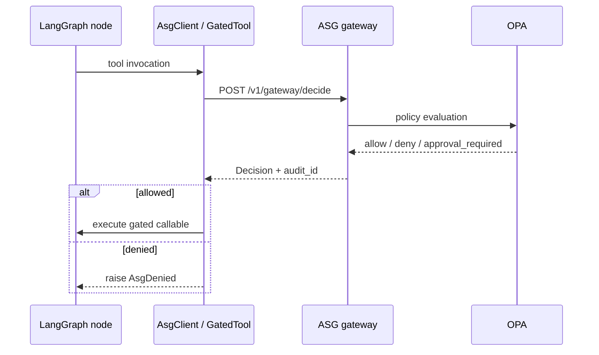

# LangGraph integration

Wire Agent Security Gate into a [LangGraph](https://github.com/langchain-ai/langgraph) agent so every tool node calls `/v1/gateway/decide` before side effects.

## Sequence



## Install

```bash
docker compose up -d --build
pip install -e '.[integrations]'
```

## Run the example

```bash
python examples/langgraph_gated_agent.py
```

Expected output (policy-dependent):

```
allow docs.read -> read:/public/readme.md (audit=…)
deny docs.read internal -> denied_doc_prefix
blocked db.write -> approval_required
```

## Pattern

Wrap each LangGraph tool side effect with `GatedTool`:

```python
from asg_sdk import AsgClient, GatedTool

client = AsgClient("http://127.0.0.1:8000", "test-token", tenant_id="acme")
gated_read = GatedTool(client, "docs.read", lambda audit_id, path: docs.read(path))

def my_node(state):
    return {"output": gated_read(path="/public/readme.md")}
```

For approval-gated tools, catch `AsgDenied` and route to a human-in-the-loop node that calls `POST /v1/approvals/request` and resumes with the resume token (see [connector-sdk.md](../connector-sdk.md)).

## Strict enforcement

Set `ASG_ENFORCE_MODE=strict` on the gateway and pass `X-ASG-Audit-Id` on adapter calls so execution cannot bypass a prior allow decision.

## Related

- [connector-sdk.md](../connector-sdk.md) — enforcement contract
- [examples/gated_agent.py](../../examples/gated_agent.py) — httpx reference agent
- [examples/langgraph_gated_agent.py](../../examples/langgraph_gated_agent.py) — LangGraph graph
