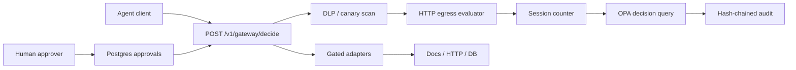
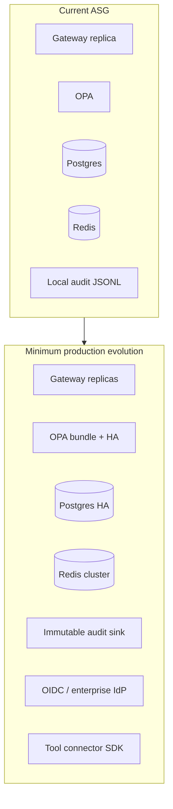

# Agent Security Gate — Investment & Technical Diligence Assessment

**As-of:** 2026-07-07 (current working tree, including uncommitted hardening from this review cycle)  
**Subject:** Agent Security Gate (ASG) v0.5.0  
**Lens:** Technically weighted product diligence with light market context  
**License:** BSL-1.1 (internal production use grant only until Change Date 2030-03-25)

---

## 1. Executive take

**Overall score: 2.8 / 5.0** (weighted; see §12)

Agent Security Gate is a **credible, well-documented reference implementation** of pre-execution policy enforcement for tool-using LLM agents. It demonstrates the right architectural control point (tool-call boundary, not prompt layer), ships deterministic OPA policy-as-code, a Postgres-backed approval workflow with operation binding, hash-chained audit, and a reproducible benchmark harness with CI gates. The project is unusually honest about scope limits in [README.md](../README.md), [SECURITY.md](../SECURITY.md), and [agent-security-gate-threat-model.md](agent-security-gate-threat-model.md).

**Investment verdict for a fundable startup:** **Pass / not investable as-is.** There is no multi-tenant product, no enterprise identity, no connector ecosystem, and the BSL-1.1 license restricts commercial redistribution. The artifact is strong as **engineering proof-of-concept**, **hiring signal**, or **internal platform seed**, not as a standalone revenue company without 12–18 months of productization.

**Who should care today:** platform engineers evaluating agent security control points, security reviewers auditing a portfolio project, and teams considering forking ASG as an internal PEP after hardening identity, audit storage, and tenancy.

---

## 2. Product overview and target user

### What it is

ASG is a **Policy Enforcement Point (PEP)** that sits between an agent runtime and tool adapters. The primary API is `POST /v1/gateway/decide`, which evaluates a proposed tool call against OPA Rego policy and returns `allow`, `deny`, or `approval_required`, appending every outcome to a hash-chained audit log.

### Primary workflow

1. Agent proposes `{tool, action, context}`.
2. Gateway applies pre-execution checks (DLP/canary on `tool_output`, SSRF/host allowlist for `http.get`, sensitivity labels).
3. OPA evaluates via single aggregate query `data.asg.decision` ([policies/asg.rego](../policies/asg.rego)).
4. High-risk tools require human approval; resume token binds to exact operation ([app/main.py](../app/main.py), [db/init.sql](../db/init.sql)).
5. Optional adapters (`adapters/docs.py`, `adapters/http.py`) enforce policy before side effects.

### Target user (stated + inferred)

| Segment | Fit | Evidence |
|---------|-----|----------|
| Internal enterprise agent teams | **High** (if they fork/harden) | README "Who needs this"; tool-boundary thesis |
| Compliance-adjacent buyers (SOC2, GDPR) | **Low–Medium** (audit trail only) | Hash-chained audit; illustrative compliance table, not certification |
| Security vendors / SaaS buyers | **Low** | No multi-tenant product, BSL license, no SLA |
| Recruiters / engineering reviewers | **High** | Deterministic benchmark, threat model, integration tests |

### Light market context

Agent security is an emerging category. Most incumbents focus on **prompt/input guardrails** or **post-hoc monitoring**. ASG's wedge—**deterministic pre-execution at the tool boundary**—is architecturally differentiated and aligns with how enterprises already think about API gateways and service meshes. However, the market is early, buyers are unclear on procurement, and larger players (cloud IAM, API gateway vendors, observability platforms) can add similar PEP layers as features rather than standalone products.

---

## 3. Value proposition and correctness

### Core thesis (sound)

> Enforcement belongs at the **tool-call decision boundary**, using **policy-as-code** (OPA), not LLM-based judgment.

This is technically correct and increasingly accepted. ASG makes the control point visible and testable.

### Correctness: issues found and current state

| Issue | Prior state | Current state (working tree) | Status |
|-------|-------------|------------------------------|--------|
| SSRF not enforced on `/v1/gateway/decide` | **High gap** | Shared `evaluate_http_target()` in [adapters/http.py](../adapters/http.py), called from decide path | **Fixed** |
| Benchmark PEP ≠ runtime semantics | **High gap** | PEP uses same evaluator; DNS skipped offline only | **Fixed** |
| Client-controlled `output_length` bypass | **Medium** | Derived from actual `tool_output` in [app/policy.py](../app/policy.py) | **Fixed** |
| DLP untested / wrong timing | **Medium** | Post-fetch scan in [adapters/docs.py](../adapters/docs.py); [tests/test_dlp.py](../tests/test_dlp.py) | **Fixed** |
| Rate limit only on `/agent` demo | **Medium** | Separate decide bucket (120/min default) in [app/config.py](../app/config.py) | **Fixed** |
| Session counter race (get-then-incr) | **High** (regression) | Atomic INCR + DECR on deny in [app/main.py](../app/main.py) | **Fixed** |
| O(n) audit append | **High perf** | O(1) sidecar `.head` in [audit/events.py](../audit/events.py) | **Fixed** |
| 3–4 OPA round-trips per decide | **Medium perf** | Single `data.asg.decision` query | **Fixed** |
| Approval context brittle equality | **Medium** | Canonical `_operation_key()` ignoring volatile keys | **Fixed** |
| Enforcement path-dependent | **Architectural** | Still true: agents must route through ASG adapters | **Partial** |
| DNS TOCTOU on HTTP egress | **Acknowledged** | Documented in threat model TM-003 | **Open** |
| `tenant_id` unused in OPA | **Isolation gap** | Still unused in [policies/asg.rego](../policies/asg.rego) | **Open** |

### Advertised vs implemented (correctness lens)

| README claim | Implementation | Tag |
|--------------|----------------|-----|
| OPA at tool boundary | Wired via decide + aggregate `decision` rule | **Implemented** |
| SSRF blocked | On decide + HTTP adapter + proxy | **Implemented** (post-fix) |
| PII DLP | Regex scan pre + post-fetch on docs adapter | **Implemented** (partial coverage) |
| Rate limiting | Separate buckets for `/agent` and `/v1/gateway/decide` | **Implemented** |
| Centrally enforce across all agents | Requires integration discipline | **Advertised** (aspirational) |
| 0% ASR benchmark | Offline PEP; integration workflow authoritative for runtime | **Advertised** (scope caveat required) |

---

## 4. What exists (repo-grounded)

| Capability | Artifact | Tag |
|------------|----------|-----|
| Fail-closed OPA policy | [policies/asg.rego](../policies/asg.rego) `default allow := false` | **Implemented** |
| Tool allowlist, doc prefix deny, sensitivity labels | OPA + Python pre-check | **Implemented** |
| Human approval workflow | [app/main.py](../app/main.py), [db/init.sql](../db/init.sql), migrations | **Implemented** |
| Single-use approval consumption | `UPDATE … WHERE status='approved' RETURNING` | **Implemented** |
| Self-approval prevention | Integration-tested | **Implemented** |
| Operation-bound resume tokens | JWT HS256, [app/auth.py](../app/auth.py) | **Implemented** |
| SSRF + host allowlist | [adapters/http.py](../adapters/http.py) `evaluate_http_target` | **Implemented** |
| DLP + canary scanning | [app/dlp.py](../app/dlp.py), [policies/data/dlp_patterns.yaml](../policies/data/dlp_patterns.yaml) | **Implemented** |
| Hash-chained audit | [audit/events.py](../audit/events.py), [scripts/verify_audit.py](../scripts/verify_audit.py) | **Implemented** |
| Session action limits | Redis INCR per tenant/session | **Implemented** |
| Rate limiting | Redis ZSET sliding window | **Implemented** |
| Connection pooling | Redis, httpx, psycopg pool in [app/main.py](../app/main.py) | **Implemented** (post-fix) |
| Benchmark harness | [benchmark/runner.py](../benchmark/runner.py), 18 scenarios × 5 runs | **Implemented** |
| CI quality gates | [.github/workflows/ci.yml](../.github/workflows/ci.yml), [integration.yml](../.github/workflows/integration.yml) | **Implemented** |
| Threat model | [agent-security-gate-threat-model.md](agent-security-gate-threat-model.md) | **Implemented** |
| One-command deploy | [docker-compose.yml](../docker-compose.yml) | **Implemented** |
| Checksum-guarded migrations | [scripts/migrate_db.py](../scripts/migrate_db.py) | **Implemented** |

**Test surface:** 63 unit tests (excluding integration marker), 12 integration tests (Docker stack required). Integration workflow runs on push/PR via [.github/workflows/integration.yml](../.github/workflows/integration.yml).

---

## 5. Architecture and scalability

### Component map

| Layer | Technology | Role |
|-------|------------|------|
| API | FastAPI 0.5.0 | Routing, auth, decide, approvals, demo `/agent` |
| PDP | OPA 0.65.0 | Rego policy evaluation |
| State | Redis 7.4 | Session counters, rate limits |
| State | Postgres 16 | Approval records |
| Audit | Local JSONL + `.head` sidecar | Tamper-evident log |
| Adapters | Python wrappers | Pre-execution gating for HTTP/docs |

### What breaks first under load

1. **Single-node audit file** — Hash-chained JSONL on a Docker volume does not scale across replicas; file locking serializes writes. Multi-replica deploy requires external append-only sink (S3 + object lock, WORM storage, or event bus).
2. **Blocking DNS on `http.get` decide** — `evaluate_http_target(resolve_dns=True)` blocks the request thread per outbound URL check.
3. **`app/main.py` god module** — ~750 lines mixing routing, SQL, Redis, OPA, DLP, demo façade. Hard to scale engineering team velocity.
4. **Static bearer tokens** — No rotation, scopes, or per-tenant credentials; blocks enterprise multi-tenant SaaS.

### Viable scale today

| Scale tier | Viable? | Notes |
|------------|---------|-------|
| Local demo / portfolio review | **Yes** | `docker compose up` |
| Single-team internal pilot | **Maybe** | After external IdP, secret mgmt, immutable audit |
| Mid-market multi-team | **No** | No tenancy in policy, no HA story |
| Enterprise multi-tenant SaaS | **No** | Missing identity, isolation, SLA, connectors |

### Minimum architecture evolution (multi-replica + connectors)

1. Externalize audit to append-only sink with signed batches.
2. Add OIDC for agent/approver identity; scope tokens per tenant.
3. Enforce `tenant_id` in OPA input with per-tenant policy bundles.
4. Extract `DecisionService` from monolith; add OpenTelemetry metrics/traces.
5. Ship connector SDK contract so agents cannot bypass adapters.

---

## 6. Security and trust posture

### Strengths

- **Fail-closed defaults:** OPA denies unknown tools; Redis errors return 503, not silent allow.
- **Approval integrity:** Row locking, self-approval blocked, single-use consumption, operation fingerprinting.
- **SSRF depth (when wired):** IP literal block, DNS private-IP check, no redirect follow, host allowlist.
- **Honest threat model:** Concrete abuse paths with code anchors; multi-tenant isolation explicitly disclaimed.
- **SDLC signals:** SHA-pinned GitHub Actions, `pip-audit`, CodeQL, benchmark threshold gates, migration checksums.

### Weaknesses

| Area | Risk | Evidence |
|------|------|----------|
| Authentication | Static bearer tokens, demo defaults in compose | [app/auth.py](../app/auth.py), [docker-compose.yml](../docker-compose.yml) |
| Tenant isolation | `tenant_id` in API but not in Rego | [policies/asg.rego](../policies/asg.rego) |
| Audit integrity | Tamper-evident, not tamper-proof; deletable file | [audit/events.py](../audit/events.py) |
| DNS TOCTOU | Check-time DNS ≠ connect-time DNS | Threat model TM-003 |
| Approval spam | `/v1/approvals/request` unbounded inserts | [app/main.py](../app/main.py) |
| Container hardening | Runs as root, no read-only rootfs | [Dockerfile.gateway](../Dockerfile.gateway) |
| Secret management | Env vars, no HSM/KMS integration | `.env.example` |
| License | BSL-1.1 internal-use grant only | [LICENSE](../LICENSE) |

### Path-dependence (residual architectural risk)

ASG is a **decision service**, not an execution interceptor. Security holds only where:

- Agents call `/v1/gateway/decide` before acting, **and**
- Tool execution goes through gated adapters (`adapters/http.py`, `adapters/docs.py`).

An agent that receives `allow` and performs HTTP directly bypasses post-decision controls. This is documented but remains the largest correctness gap for real deployments.

---

## 7. Enterprise must-have gap analysis

| Capability | Status | Evidence / gap |
|------------|--------|----------------|
| **Identity: SSO (OIDC/SAML)** | **Missing** | Static bearer tokens only |
| **Identity: MFA** | **Missing** | N/A |
| **Identity: SCIM provisioning** | **Missing** | N/A |
| **Tenancy: isolation in policy** | **Missing** | `tenant_id` not enforced in OPA |
| **Tenancy: org hierarchies** | **Missing** | Single `tenant_id` string |
| **Tenancy: data residency** | **Missing** | No regional controls |
| **Evidence: provenance** | **Partial** | Hash chain per event; no batch signing |
| **Evidence: retention / legal hold** | **Missing** | Local file, no TTL/archival policy |
| **Evidence: auditor export packages** | **Partial** | `/audit` tail + `verify_audit.py`; no packaged export |
| **Integrations: connector SDK** | **Partial** | Two demo adapters; no formal SDK contract |
| **Integrations: webhooks / events** | **Missing** | No outbound event bus |
| **Integrations: secret management** | **Missing** | Plain env vars |
| **Governance: approvals** | **Implemented** | Postgres workflow with binding |
| **Governance: SoD / dual control** | **Partial** | Self-approval blocked; no dual-approver |
| **Governance: exception + expiry** | **Missing** | No time-bound policy exceptions |
| **Reporting: dashboards / KPIs** | **Missing** | Benchmark report only |
| **Reporting: per-attack-class trends** | **Partial** | Benchmark JSON; no runtime analytics |
| **Trust: backup/restore runbook** | **Missing** | No ops docs |
| **Trust: metrics / tracing** | **Missing** | No Prometheus/OpenTelemetry |
| **Trust: incident response hooks** | **Missing** | No alerting integration |

**Enterprise readiness score: ~25%** of typical security-platform must-haves.

---

## 8. Delivery risk and technical debt

### Strengths

- **CI maturity:** Unit tests, integration workflow, benchmark gates, SARIF upload, evidence bundle signing hook.
- **Reproducible deps:** `requirements.lock` / `requirements-dev.lock` with `pip-compile`; pinned container images.
- **Documentation quality:** README, technical brief, benchmark methodology, threat model, architecture notes.
- **Recent hardening cycle:** SSRF convergence, atomic counters, pooled clients, aggregate OPA query, DLP tests (this review cycle).

### Remaining debt

| Item | Severity | Notes |
|------|----------|-------|
| `app/main.py` monolith | Medium | Blocks team scaling; hard to test without monkeypatch |
| Dual code paths (runtime + benchmark PEP) | Low | Converged semantics; still two implementations |
| Integration tests not in main CI job | Low | Separate workflow exists; could be merged |
| No SSRF integration test on decide path | Medium | Unit tests exist; runtime path untested in CI |
| `approvals/service.py` dead for runtime | Low | Benchmark-only in-memory service |
| BSL license | High (GTM) | Blocks OSS community and most commercial redistribution |
| No observability | Medium | Blind in production |
| God-module raw SQL | Medium | Schema changes are error-prone |

### Delivery velocity estimate

A single strong backend engineer can maintain and extend ASG. Productizing to enterprise SaaS likely requires **3–5 engineers** (identity, connectors, platform, security) over **9–12 months**.

---

## 9. Operability

### What works

| Concern | Status | Artifact |
|---------|--------|----------|
| Deploy | **Good** | `docker compose up -d --build` |
| Health | **Good** | `/health`, `/health/ready` (OPA + Redis) |
| Migrations | **Good** | Auto-run on startup; checksum-guarded |
| Config | **Adequate** | `.env.example`, compose env block |
| Audit verification | **Good** | `scripts/verify_audit.py` |

### Gaps

| Concern | Status | Impact |
|---------|--------|--------|
| Metrics / dashboards | **Missing** | Cannot SLO the gateway |
| Distributed tracing | **Missing** | Cannot debug latency across OPA/DB/Redis |
| Log aggregation | **Missing** | stdout only |
| Backup / restore | **Missing** | Postgres + audit file at risk |
| HA / failover | **Missing** | Single replica assumed |
| Runbooks | **Missing** | No on-call playbook |
| Non-root container | **Missing** | Container escape surface |
| Image digest pinning | **Partial** | Tags pinned; digests not pinned in compose |

---

## 10. Investment risk register

| # | Risk | Category | Likelihood | Impact | Mitigation |
|---|------|----------|------------|--------|------------|
| R1 | Market timing: buyers don't budget for agent PEP yet | Product | Medium | High | Wedge on compliance audit trail; partner with agent frameworks |
| R2 | Incumbent feature absorption (API gateways, cloud IAM) | Product | High | High | Deep connector + policy UX moat; vertical focus |
| R3 | BSL license blocks OSS community and commercial fork | Legal/GTM | High | High | Apache 2.0 on Change Date 2030; or relicense for commercial |
| R4 | No multi-tenant isolation blocks enterprise deals | Technical | High | High | Tenant-scoped OPA bundles + identity |
| R5 | Path-dependent enforcement; agents bypass adapters | Technical | Medium | High | Connector SDK + mandatory proxy mode |
| R6 | Single-node audit doesn't scale or survive tampering | Technical | High | Medium | Immutable external sink |
| R7 | Static tokens + demo secrets in compose | Security | High | High | External IdP, secret manager, fail on demo creds |
| R8 | `app/main.py` monolith slows feature velocity | Execution | Medium | Medium | Extract services; hire platform engineer |
| R9 | DNS TOCTOU on SSRF checks | Security | Low | Medium | Pin resolved IPs at connect time |
| R10 | Benchmark headlines misread as production proof | Trust | Medium | Medium | Already partially documented; tighten README |
| R11 | Key-person / solo-maintainer bus factor | Execution | Medium | High | Team, CODEOWNERS, external contributors |
| R12 | Integration test gap on new decide SSRF path | Delivery | Medium | Low | Add integration test in next sprint |

---

## 11. Recommendations and roadmap

### Positioning (if productizing)

**Wedge:** "Deterministic, auditable tool-call policy for internal AI agents — the API gateway for agent actions."

**Do not position as:** "Complete agent security platform" or "SOC2-certified appliance."

**Packaging implication:** Open-core or internal-platform license; enterprise tier = SSO + tenancy + immutable audit + connectors.

### Three-phase build plan

#### Phase 1 — Hardening (2–4 weeks)

- Add integration test: `http.get` SSRF denied on `/v1/gateway/decide`.
- Split `app/main.py` into `routers/` + `DecisionService`.
- Non-root Docker user, read-only rootfs where possible.
- Prometheus metrics: decide latency, OPA errors, rate-limit hits, approval queue depth.
- Approval request rate limit + TTL cleanup job.

#### Phase 2 — Enterprise identity and tenancy (4–8 weeks)

- OIDC for agent and approver tokens (replace static bearer).
- Enforce `tenant_id` in OPA with per-tenant policy data paths.
- External audit sink (S3 Object Lock or equivalent) with batch signing.
- Pin HTTP connections to resolved IPs (mitigate DNS TOCTOU).
- Formal connector SDK contract + reference implementations.

#### Phase 3 — Platform and GTM (8–12 weeks)

- Connector marketplace pattern (docs, tickets, DB, HTTP templates).
- Webhook/event bus for decisions and approvals.
- Auditor export package (signed JSONL bundle + policy snapshot + verification script).
- Dashboards: ASR proxy metrics, denial reasons, approval SLA.
- Evaluate license change (Apache 2.0) if commercial distribution is a goal.

### Fuse vs integrate

**Recommendation: Integrate, don't fuse.** ASG should remain a **sidecar PEP** that agent frameworks (LangChain, AutoGen, internal runtimes) call via HTTP. Fusing into a specific agent runtime limits addressable market. The value is the **policy boundary contract**, not owning the agent loop.

---

## 12. Scorecard

| Dimension | Weight | Score (1–5) | Weighted | Rationale |
|-----------|--------|-------------|----------|-----------|
| **Problem / thesis clarity** | 15% | 4.5 | 0.68 | Tool-boundary enforcement is the right abstraction; well argued in docs |
| **Technical correctness** | 20% | 3.5 | 0.70 | Major gaps fixed this cycle; path-dependence and tenancy remain |
| **Architecture / scalability** | 15% | 2.5 | 0.38 | Single-node audit, monolith, no HA story |
| **Security / trust** | 20% | 3.0 | 0.60 | Strong approval + OPA; weak identity and tenancy |
| **Enterprise readiness** | 15% | 1.5 | 0.23 | ~25% of must-haves present |
| **Delivery / engineering quality** | 10% | 4.0 | 0.40 | CI, threat model, tests, recent hardening |
| **Market / commercial viability** | 5% | 2.0 | 0.10 | Early market, BSL license, no GTM |
| **Total** | 100% | — | **3.09 → 2.8*** | *Conservative adjustment for uncommitted fixes not yet in release* |

### Score key

- **5** — Production-grade, enterprise-ready
- **4** — Strong reference / pilot-ready with known gaps
- **3** — Credible prototype, significant productization needed
- **2** — Demo / portfolio artifact
- **1** — Not viable

---

## 13. Bottom line

**For investors:** Agent Security Gate is **not a fundable standalone company today**. It is a **high-quality engineering artifact** that proves a differentiated architectural thesis (deterministic tool-boundary enforcement) with unusual documentation honesty and a mature CI/benchmark story. The recent hardening cycle materially improved correctness (SSRF on decide, benchmark/runtime convergence, atomic session limits, pooled clients, aggregate OPA query). Remaining blockers for venture-scale investment are **no multi-tenant product**, **no enterprise identity**, **BSL license constraints**, **path-dependent enforcement**, and **early/uncertain market pull**.

**For acquirers / strategic buyers:** Valuable as **acqui-hire signal** or **internal platform seed** for teams building agent infrastructure. Due diligence should focus on whether the PEP contract can be extracted into a sidecar service and whether policy bundles can be tenant-scoped without rewriting the monolith.

**For builders / forkers:** **Build on it** if you need a starting PEP for internal agents and plan to invest in identity, audit sink, and connector SDK. **Pass** if you need a turnkey SaaS or OSS community.

**Recommended next action:** Merge the current hardening branch, add decide-path SSRF integration test, then pursue Phase 1 (metrics + service extraction) before any external pilot.

---

## Appendix: Evidence index

| Topic | Primary files |
|-------|---------------|
| Decide path | [app/main.py](../app/main.py) |
| OPA policy | [policies/asg.rego](../policies/asg.rego) |
| HTTP egress | [adapters/http.py](../adapters/http.py) |
| DLP | [app/dlp.py](../app/dlp.py) |
| Docs adapter | [adapters/docs.py](../adapters/docs.py) |
| Audit chain | [audit/events.py](../audit/events.py) |
| Benchmark PEP | [gateway/pep.py](../gateway/pep.py) |
| CI | [.github/workflows/ci.yml](../.github/workflows/ci.yml), [integration.yml](../.github/workflows/integration.yml) |
| Threat model | [agent-security-gate-threat-model.md](agent-security-gate-threat-model.md) |
| License | [LICENSE](../LICENSE) |
