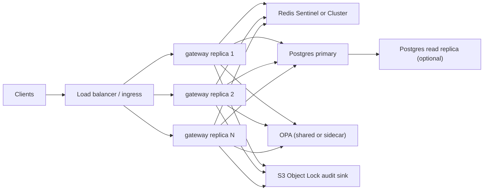

# HA and multi-replica deployment (WS-18)

Agent Security Gate is **stateless at the HTTP layer**: session counters, rate limits, and
enforcement grants live in **Redis**; approvals and policy exceptions live in **Postgres**.
Any gateway replica can serve any request.

## Local drill (Docker Compose)

```bash
export ASG_UID=$(id -u) ASG_GID=$(id -g)
docker compose -f docker-compose.yml -f docker-compose.ha.yml up -d --build
```

This starts:

| Component | Role |
|-----------|------|
| `gateway` × 2 | Stateless FastAPI replicas (no host port) |
| `lb` | nginx reverse proxy on `${GATEWAY_PORT:-8000}` |
| `redis`, `postgres`, `opa` | Shared backing services (single-node for local drill) |

Scale further:

```bash
docker compose -f docker-compose.yml -f docker-compose.ha.yml up -d --scale gateway=3
```

### Smoke test

```bash
curl -sf http://127.0.0.1:8000/health/ready
ASG_HA=1 python -m pytest tests/integration/test_ha.py -q
```

The integration test hammers `/v1/gateway/decide` concurrently through the load balancer
and asserts every response is `200`.

## Per-replica audit chains

**Do not** point multiple replicas at one shared `events.jsonl` file — concurrent appends
fork the hash chain (even with `fcntl` locking, a crash between write and head update can
split the chain).

Each replica sets `ASG_REPLICA_ID` to its hostname at startup (see `docker-compose.ha.yml`).
`audit_log_path()` then resolves to `events-<replica>.jsonl`, so every replica maintains an
independent, verifiable chain on a shared volume:

```bash
ls audit/events-*.jsonl
python scripts/verify_audit.py --path audit/events-<replica>.jsonl
```

In **production**, prefer the S3 Object Lock sink (`AUDIT_S3_*`) so audit durability does
not depend on a shared local volume at all. Per-replica local files are acceptable for
dev/HA drills; compliance exports should use `POST /v1/audit/export` or the S3 bundle
verifier.

## Concurrency-safe migrations

`scripts/migrate_db.py` acquires a Postgres **advisory lock** before applying pending
migrations. Multiple replicas starting simultaneously will not race on DDL or duplicate
version inserts.

## Production topology



| Concern | Local drill | Production recommendation |
|---------|-------------|---------------------------|
| Gateway | 2 replicas + nginx | ≥2 pods behind cloud LB / ingress |
| Redis | Single node | Sentinel or Cluster for failover |
| Postgres | Single node | Managed primary + replica; connection pooling |
| Audit | Per-replica local files | `AUDIT_S3_*` Object Lock sink only |
| OPA | Shared container | Shared OPA deployment or sidecar per pod |
| Secrets | Demo tokens | `*_FILE` mounts, no `ASG_DEMO_MODE` |

## Health and readiness

- `GET /health` — process is up (use for LB health checks).
- `GET /health/ready` — OPA and Redis are reachable (use before sending traffic after deploy).

Each replica runs its own readiness probe; the load balancer should only route to replicas
that pass.

## Known limitations (local overlay)

- Redis and Postgres are single-node; losing either node stops the stack.
- nginx uses Docker DNS re-resolution (`deploy/nginx.ha.conf`) so scaled replicas are picked
  up without reloading.
- Session stickiness is **not** required; Redis holds shared session state.

## Related

- [backup-restore.md](backup-restore.md) — `scripts/backup.sh` now includes all
  `events-*.jsonl` per-replica streams.
- [architecture.md](../architecture.md) — module map and data flows.
- WS-11 immutable audit sink — production audit durability.
